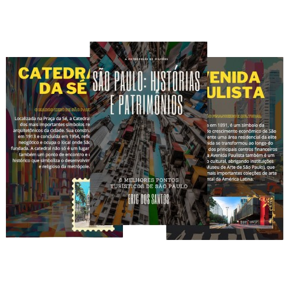

    

-------

# Projeto EBOOK Gerado por I.A.s

Projeto com o objetivo de gerar um ebook digital com as facilidades das ferramentas de IA. todos os prompts
seguem abaixo.

<a href="output/São Paulo Histórias e Patrimônios.pdf" title="View PDF now"> 📕Clique aqui para ler</a>

## 💻 Tecnologias utilizadas no projeto

- [ChatGPT](https://chat.openai.com/) 
- [IA Canva](https://www.canva.com/pt_br/gerador-imagem-ia/)
- [Canva](https://www.canva.com/pt_br/criar/)

## 🧠 Prompts

ChatGPT：

|   Ação   | prompt                                                                                                                                                                                                                                                                         |
| :------: | ------------------------------------------------------------------------------------------------------------------------------------------------------------------------------------------------------------------------------------------------------------------------------ |
|  título  | Crie um título de um ebook sobre o melhores pontos turísticos em São Paulo, o ebookk é do nicho de turismo e o subnicho é de atrativos sócio-históricos, o título deve ser épico e curto, e tenha uma temática de história da cidade no título, me liste 5 variações de títulos                                                        |
| conteúdo | Faça um texto para ebook , com foco em turismo, listando os principais pontos turísticos de São Paulo: {REGRAS} Traga sempre o contexto sócio-histórico do ponto turístico; deixe o texto enxuto; sempre deixe um título sugestivo por tópico |

IA Canva:

|  Ação  | prompt                                                                                 |
| :----: | -------------------------------------------------------------------------------------- |
| imagens/plano de fundo | imagem do(a) {nome do ponto turístico} sobre a pesperctiva de nostalgia e cores vivas. Com um cenário que retrate o contidiano urbano do ponto turístico no século XXI.|

## ✨ Features

- Conteúdo gerado via ChatGPT
- Imagens geradas via IA do Canva

## 📚 Materiais

- Imagens utilizadas em `assets\imagens`
- ebook gerado durante as aulas em `output`

## 🛠️ Instruções de execução

Utilize os prompts acima nas ferramentas sugeridas para gerar o material base e utilize uma ferramenta de edição de documentos como power point, libreoffice , indesign para diagramação.

---

⌨️ com 💜 por [Eric dos Santos.](https://github.com/ericshantos)
